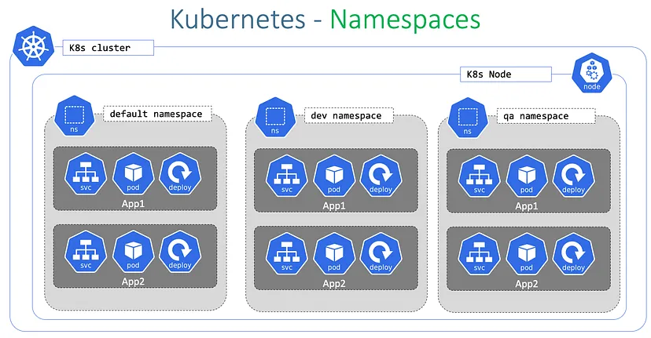
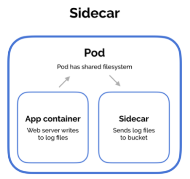
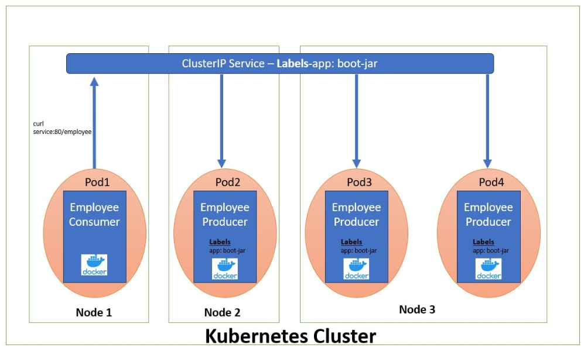
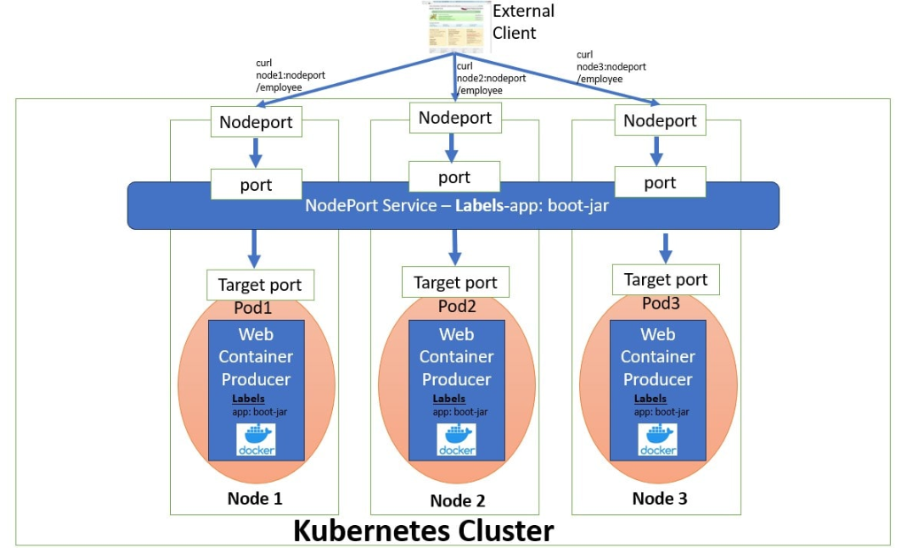
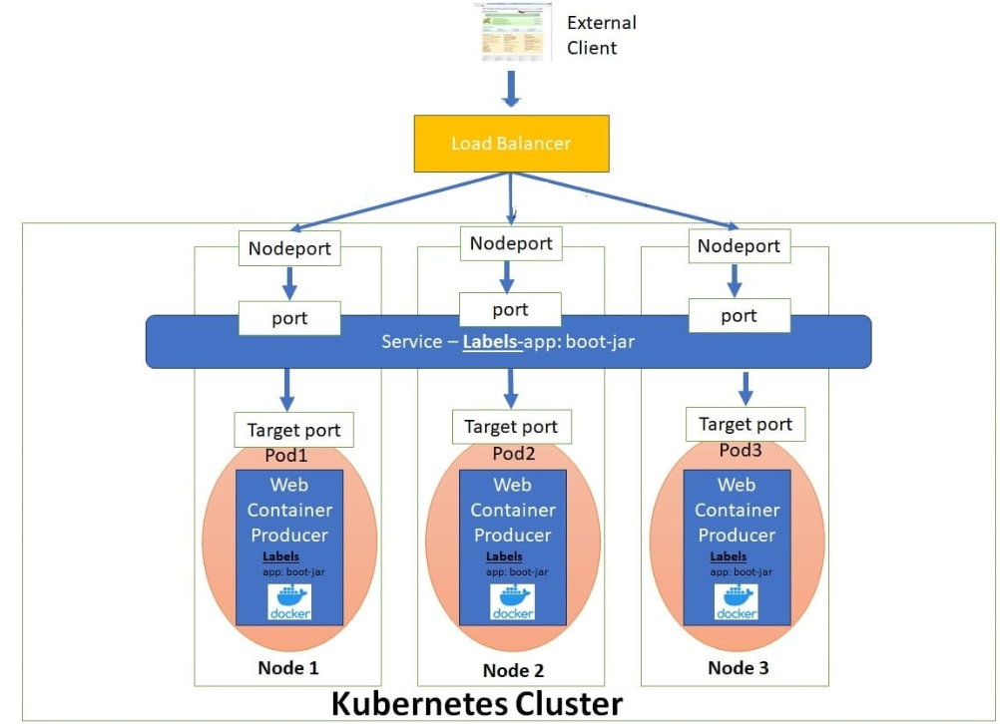

## namespace



In Kubernetes, a namespace is a logical partition within a Kubernetes cluster that is used to divide resources and isolate them from one another.

Namespaces are a key organizational tool that helps manage resources effectively in large-scale Kubernetes deployments by

## Isolated Environment:

Each namespace provides an isolated space within the same Kubernetes cluster. Resources in one namespace don’t interfere with those in another.

``Example``: Teams or applications can work independently within their own namespaces.

## Partitioning Based on Teams or Environments:

Namespaces can be used to logically separate:
Different teams: team-A, team-B, etc.
Different environments: dev, test, prod.

## Compute Resource Management:

Namespaces allow you to set resource quotas (CPU, memory, etc.) so that each partition gets only the required resources and prevents one namespace from over-consuming cluster resources.

## Access Control (RBAC):

Role-Based Access Control (RBAC) can be configured to grant permissions for users or services to interact only with specific namespaces.

``Example``: Developers in team-A can only access team-A-namespace and cannot interact with resources in team-B-namespace.

---
---
### **What is a Pod in Kubernetes?**

A **Pod** is the smallest and most basic deployable unit in Kubernetes. It represents a single instance of a running process in your cluster. A Pod can contain one or more tightly coupled containers (usually one container per Pod is the common use case).

---

### **Key Features of a Pod**

1. **Single Unit of Deployment:**
   - A Pod is the smallest unit you can deploy and manage in Kubernetes.

2. **Shared Context:**
   - Containers in a Pod share:
     - **Network namespace:** Containers communicate using `localhost`.
     - **Storage volumes:** Containers share mounted volumes.
     - **Lifecycle:** Containers in a Pod are started, stopped, and restarted together.

3. **Use Case:**
   - Typically used to run a single containerized application.
   - In some cases, a Pod may include multiple containers for tightly coupled processes (e.g., a web server and a logging agent).

---

### **Why Pods?**
Pods abstract the complexity of managing individual containers by providing:
- Networking: Each Pod gets its own IP address.
- Storage: Shared volumes for containers within the Pod.
- Management: Lifecycle and scheduling handled by Kubernetes.

---

**Apply this Pod:**
```bash
kubectl apply -f nginx-pod.yaml
```

**Verify the Pod:**
```bash
kubectl get pods
```

---

### **Pod Lifecycle**

A Pod goes through the following phases:
1. **Pending:** Kubernetes has created the Pod but hasn't scheduled it on a node yet.
2. **Running:** The Pod has been scheduled, and its containers are running.
3. **Succeeded:** The Pod's containers have successfully terminated.
4. **Failed:** One or more containers in the Pod terminated with an error.
5. **Unknown:** The state of the Pod could not be determined.

You can check the status with:
```bash
kubectl get pods
kubectl describe pod <pod-name>
```

---

### **Common Commands to Manage Pods**

1. **View All Pods:**
   ```bash
   kubectl get pods
   ```
2. **Get Detailed Information About a Pod:**
   ```bash
   kubectl describe pod <pod-name>
   ```
3. **Delete a Pod:**
   ```bash
   kubectl delete pod <pod-name>
   ```
4. **Logs from a Pod:**
   ```bash
   kubectl logs <pod-name>
   ```

---
---
### **Multi-Container Pod Patterns and Init-Containers in Kubernetes**


---

### **1. Multi-Container Pod Patterns**
A Multi-Container Pod is a Pod that runs multiple containers working together to achieve a common goal. These containers share resources like networking and storage but serve different purposes.

---

#### **Common Multi-Container Pod Patterns**

1. **Sidecar Pattern**
   - **Purpose:** A helper container that enhances or extends the functionality of the main container.
   - **Use Case:** Logging, monitoring, or injecting configuration data.

   **How It Works:**
   - `nginx` writes logs to `/var/log/nginx`.
   - The sidecar container (`busybox`) tails the logs for real-time analysis or shipping to a centralized system.

---

2. **Adapter Pattern**
   - **Purpose:** Converts or transforms data between two components.
   - **Use Case:** Translating metrics, data normalization.

   **Example: Adapter for Data Normalization**
   - One container generates raw data.
   - Another processes it and transforms it into a required format.

---

3. **Ambassador Pattern**
   - **Purpose:** A helper container that acts as a proxy for the main container.
   - **Use Case:** Handling networking or service discovery.

---

4. **Sidecar with Shared Volume Pattern**
   - Containers share a volume for temporary or persistent storage.

   **Example:** A file processor container works alongside a downloader container.

---

### **2. Init-Containers**

#### **What Are Init-Containers?**
Init-Containers are special containers that run **before the main application containers** in a Pod. They perform initialization tasks and must complete successfully before the main containers start.

---

#### **Why Use Init-Containers?**
- Perform setup or pre-requisite tasks (e.g., downloading files, setting environment variables).
- Ensure application containers start with the required configuration or data.
- Run in sequential order and ensure the Pod is ready for the main application.

---

**How It Works:**
1. The `init-config-fetcher` container prepares configuration data and writes it to a shared volume.
2. Once the Init-Container completes, the `nginx` container starts, using the prepared configuration.

---

### **Key Differences Between Init-Containers and Main Containers**

| **Aspect**         | **Init-Containers**                  | **Main Containers**                  |
|---------------------|--------------------------------------|--------------------------------------|
| **Purpose**         | Initialization tasks                | Running the main application         |
| **Execution**       | Run sequentially before main        | Run concurrently in the Pod          |
| **Restart Policy**  | Restarted until successful          | Follows the Pod’s restart policy     |
| **Dependencies**    | Sets up prerequisites               | Depends on Init-Container completion |

---

### **When to Use Each?**

| **Feature**                | **Use Case**                                                                 |
|----------------------------|-----------------------------------------------------------------------------|
| **Multi-Container Pod**    | Multiple tightly coupled processes that share resources and work together. |
| **Init-Containers**        | Initialization tasks like setting up data, waiting for dependencies, etc.  |

---
---

### **Difference Between Labels and Annotations in Kubernetes**

---

| **Aspect**          | **Labels**                                            | **Annotations**                                       |
|----------------------|-------------------------------------------------------|-------------------------------------------------------|
| **Purpose**          | Identify and organize resources for selection & grouping. | Attach metadata to resources for informational purposes. |
| **Key Functionality**| Used for filtering, querying, and grouping resources.  | Used for storing non-identifying metadata.            |
| **Selectors**        | Can be used in **selectors** (e.g., Deployments, Services). | Cannot be used for selectors or filtering.            |
| **Size Limitation**  | Small key-value pairs for efficient querying.          | Larger key-value pairs are allowed for detailed metadata. |
| **Visibility**       | Directly influences Kubernetes operations (e.g., scheduling). | Purely informational; doesn't affect cluster operations. |
| **Examples**         | `app=frontend`, `env=prod`                            | `maintainer=team@example.com`, `description=Project X` |

---
---
### **Labels**

#### **Definition**
Labels are key-value pairs attached to Kubernetes objects, primarily used for identifying and selecting resources.

#### **Use Cases**
1. **Organizing Resources**
   - Group resources by environment, team, or application.
   - Example: All resources related to the `frontend` app in `production`.

2. **Selectors**
   - Used to target specific resources in Deployments, Services, etc.
   - Example: A Service selecting Pods with the label `app=frontend`.

3. **Scheduling**
   - Help Kubernetes determine on which nodes to run Pods.
   - Example: Use node labels to run a workload only on specific nodes.

4. **Rollouts**
   - Use labels like `version=v1` to control traffic during a rollout.
---

### **Annotations**

#### **Definition**
Annotations are key-value pairs used for attaching metadata to resources. They do not affect Kubernetes operations but provide information for external systems or tools.

#### **Use Cases**
1. **Documentation**
   - Add descriptive metadata to resources for clarity.
   - Example: Annotating Pods with a `description` field.

2. **Configuration Management**
   - Attach external configuration details, such as the git commit hash or build ID.

3. **Tool Integration**
   - Used by tools like Helm, Prometheus, or CI/CD systems to store extra information.

4. **Debugging/Tracing**
   - Store diagnostic information, like reasons for restarts.
---

### **Summary of Use Cases**

| **Feature**          | **Labels**                              | **Annotations**                          |
|-----------------------|------------------------------------------|------------------------------------------|
| **Grouping Resources**| Organize by app, environment, or team.  | Not used for grouping.                   |
| **Selectors**         | Select resources for Deployments, Services, etc. | Not applicable.                         |
| **Documentation**     | Basic identification.                   | Detailed metadata for documentation.     |
| **Tool Integration**  | Basic filtering and identification.      | External system-specific information.    |
| **Example Queries**   | `kubectl get pods -l app=frontend`      | Cannot query resources using annotations.|

---
---
### Environment Variables in Kubernetes
Environment variables in Kubernetes allow you to pass configuration data to containers. This approach is useful for separating configuration from the application code, ensuring flexibility and portability.
## use cases
- Defining Environment Variables in a Pod
- Using ConfigMaps for Environment Variables
- Using Secrets for Sensitive Data
- Using Downward API for Pod Metadata
- Combining Environment Variables
---
---
### Resources


In Kubernetes, **resources** in a Pod refer to the **CPU** and **memory** (RAM) allocated to the containers within the Pod. Kubernetes allows you to specify **resource requests** and **limits** for each container to ensure efficient resource utilization and prevent one container from monopolizing cluster resources.

---

### **1. Resource Types**

1. **Requests**:
   - The amount of CPU and memory that a container is guaranteed.
   - Kubernetes uses this to schedule Pods on nodes that have enough resources available.
   - Example: "I need 200m of CPU and 256Mi of memory."

2. **Limits**:
   - The maximum amount of CPU and memory a container can use.
   - If a container tries to exceed the limit:
     - For CPU: Kubernetes throttles the container.
     - For memory: The container is killed (out-of-memory error).

---

### **2. Specifying Resources in a Pod**

#### **Example: Setting Requests and Limits**
```yaml
apiVersion: v1
kind: Pod
metadata:
  name: resource-demo
spec:
  containers:
  - name: nginx-container
    image: nginx
    resources:
      requests:
        memory: "256Mi"
        cpu: "200m"
      limits:
        memory: "512Mi"
        cpu: "500m"
```

#### **Explanation**:
- **Requests**:
  - `memory: "256Mi"`: The container is guaranteed 256Mi of memory.
  - `cpu: "200m"`: The container is guaranteed 200 milliCPU (20% of a single CPU core).
- **Limits**:
  - `memory: "512Mi"`: The container can use up to 512Mi of memory.
  - `cpu: "500m"`: The container can use up to 500 milliCPU (50% of a single CPU core).

---

### **3. How Requests and Limits Work**

1. **CPU**:
   - Measured in CPU units.
   - `1 CPU` = 1 vCPU/Core for a cloud provider, or 1 hyperthread on a bare-metal processor.
   - Example: 
     - `200m` = 0.2 CPU cores.
     - `1` = 1 full CPU core.

2. **Memory**:
   - Measured in bytes.
   - Suffixes: `Mi` (mebibytes), `Gi` (gibibytes), etc.
   - Example:
     - `256Mi` = 256 Mebibytes.
     - `1Gi` = 1 Gibibyte.

---

### **4. Resource Overcommitment**

- Kubernetes allows overcommitment by scheduling more Pods than the total capacity of the cluster.
- Containers are guaranteed their **requests**, but if the node is under pressure:
  - Containers exceeding their **limits** might be throttled or killed.

---

### **5. Resource Management in Kubernetes**

1. **QoS (Quality of Service) Classes**:
   Pods are assigned a QoS class based on their resource configuration:
   - **Guaranteed**:
     - Requests = Limits for all containers in the Pod.
     - Example: CPU requests and limits are both set to `1`.
   - **Burstable**:
     - Requests < Limits for one or more containers.
     - Example: CPU request is `200m`, but the limit is `500m`.
   - **BestEffort**:
     - No requests or limits are specified.
     - Pods are the first to be evicted under resource pressure.

2. **Node-Level Resource Allocation**:
   - Kubernetes schedules Pods on nodes with sufficient resources to meet the **requests**.

---

### **6. Commands to Check Resources**

- **Describe a Pod**:
  ```bash
  kubectl describe pod resource-demo
  ```
  This shows resource requests and limits for the Pod.

- **List Nodes with Allocated Resources**:
  ```bash
  kubectl describe nodes
  ```

---

### **7. Example: Scenario**

#### **Problem**:
You have an application that processes images. It needs:
- 1 CPU for smooth processing.
- 512Mi of memory for each worker.

#### **Pod Spec**:
```yaml
apiVersion: v1
kind: Pod
metadata:
  name: image-processor
spec:
  containers:
  - name: worker
    image: worker-app
    resources:
      requests:
        memory: "512Mi"
        cpu: "1"
      limits:
        memory: "1Gi"
        cpu: "2"
```
- Guarantees:
  - Each worker gets at least 1 CPU and 512Mi memory.
- Limits:
  - Each worker can use up to 2 CPUs and 1Gi memory.

---

### **Key Takeaways**

- **Requests** are the minimum guaranteed resources.
- **Limits** are the maximum resources a container can use.
- Proper resource management helps optimize cluster utilization and avoids resource starvation.
- Use **kubectl describe** and monitoring tools (like Prometheus) to track resource usage.
---
---
### Relation between Nodes and Resources
To determine how many containers can run on a node in a Kubernetes cluster, we need to consider the **available resources on the node** and the **resource requests and limits for the containers** in the Pods. Let's clarify the setup and calculate:

---

### **1. Node Specifications**

You have:
- **Node type:** `t3.medium`
- **Node count:** 3 nodes in a node group.
- **t3.medium resources:**
  - **vCPUs:** 2
  - **Memory:** 4 GiB

However, not all resources are available for Pods because Kubernetes reserves some resources for system processes like kubelet, kube-proxy, and others.

---

### **2. Resource Reservation for System Processes**

Kubernetes typically reserves around **10% of CPU and memory** for system processes on smaller nodes. For a `t3.medium` node, this means:

- **Available CPU for Pods:**
  \[
  2 \text{ vCPUs} - 10\% = 1.8 \text{ vCPUs (1800m)}
  \]

- **Available Memory for Pods:**
  \[
  4 \text{ GiB} - 10\% = 3.6 \text{ GiB (3686Mi)}
  \]

---

### **3. Resource Allocation for Containers**

The number of containers a node can support depends on the **resource requests** for the containers.

#### Example 1: Small Containers
If each container requests:
- **CPU:** 100m (0.1 CPU)
- **Memory:** 256Mi

Then, on a single node:
- **CPU capacity:**
  \[
  \frac{1800m}{100m} = 18 \text{ containers}
  \]
- **Memory capacity:**
  \[
  \frac{3686Mi}{256Mi} = 14 \text{ containers}
  \]

In this case, the memory constraint allows **14 containers** per node.

With **3 nodes**, the total cluster supports:
\[
14 \times 3 = 42 \text{ containers}
\]

---

#### Example 2: Larger Containers
If each container requests:
- **CPU:** 500m (0.5 CPU)
- **Memory:** 1 GiB

Then, on a single node:
- **CPU capacity:**
  \[
  \frac{1800m}{500m} = 3 \text{ containers}
  \]
- **Memory capacity:**
  \[
  \frac{3686Mi}{1024Mi} = 3 \text{ containers}
  \]

Here, both CPU and memory constraints allow **3 containers** per node.

With **3 nodes**, the total cluster supports:
\[
3 \times 3 = 9 \text{ containers}
\]

---

### **4. Impact of Overcommitment**

Kubernetes allows overcommitting resources by setting **requests < limits**. For example:
- If requests are 200m CPU but limits are 500m CPU, more Pods can be scheduled.
- However, during high resource usage, Pods may be throttled or evicted if limits are exceeded.

---

### **5. Factors to Consider**

1. **Resource Requests and Limits**:
   - Properly configure these to balance utilization and stability.

2. **Pod Overhead**:
   - Account for additional resources used by the Pod infrastructure.

3. **Node Autoscaling**:
   - If enabled, the cluster can scale up nodes when resources are insufficient.

4. **DaemonSets**:
   - DaemonSets (e.g., for monitoring or logging agents) run on all nodes and consume resources.

---

### **6. Practical Formula**

To estimate the number of containers per node:
\[
\text{Containers per Node} = \min\left(\frac{\text{Available CPU}}{\text{Container CPU Request}}, \frac{\text{Available Memory}}{\text{Container Memory Request}}\right)
\]

For a cluster with multiple nodes:
\[
\text{Total Containers} = \text{Containers per Node} \times \text{Node Count}
\]

---

### **7. Key Takeaways**

- The number of containers depends on the **container resource requests**, node size, and reserved system resources.
- Smaller containers allow higher density but can lead to overcommitment risks.
- Use monitoring tools like **Prometheus** and **Kubernetes Metrics Server** to track actual resource usage.

---
### Best Practices
1. Set Requests and Limits for All Pods:

    Prevent resource contention and ensure stability.
2. Use LimitRange:
    
    Define namespace-wide defaults for requests and limits to handle Pods with no explicit configuration.

3. Monitor Usage:

    Use tools like Prometheus and Grafana to monitor actual usage and adjust resource allocations accordingly.

5. Start Small:
    Begin with conservative values for requests and limits, then refine based on performance monitoring.

---
---
### **ConfigMap in Kubernetes**

A **ConfigMap** in Kubernetes is a resource used to store configuration data in key-value pairs. It allows you to decouple configuration details from application code, making it easier to manage and update configuration without redeploying your application.

ConfigMaps are designed to handle non-sensitive data such as:
- Application settings
- URLs
- File paths
- Environment-specific configurations

> For sensitive data, Kubernetes provides **Secrets**.

---

### **Usages of ConfigMaps**

1. **Store Configuration Data**:
   ConfigMaps store data like environment variables, command-line arguments, or configuration files, which can be injected into Pods at runtime.

2. **Decouple Configuration**:
   Allows developers to keep application configuration separate from the application code, enabling better portability and flexibility.

3. **Dynamic Updates**:
   Some applications can dynamically read configuration updates from ConfigMaps without requiring a restart.

4. **Environment Management**:
   Easily manage different configurations for different environments (e.g., development, testing, production).

5. **Multi-Pod Consistency**:
   Use the same ConfigMap across multiple Pods to ensure consistency.

---

The primary difference between **ConfigMaps** and **Secrets** in Kubernetes lies in their purpose and how they handle data:

| **Feature**               | **ConfigMap**                                      | **Secret**                                          |
|---------------------------|---------------------------------------------------|---------------------------------------------------|
| **Purpose**               | Stores non-sensitive configuration data.          | Stores sensitive data like passwords, tokens, etc.|
| **Data Encoding**         | Stored in plain text.                             | Encoded in Base64 format for added security.      |
| **Use Case**              | Application settings, URLs, file paths.           | API keys, database passwords, certificates.       |
| **Security Focus**        | Not designed for sensitive data.                  | Designed specifically for sensitive data.         |
| **Access Control**        | Less restrictive; not encrypted by default.       | Provides encryption at rest; integrates with secrets management tools. |
| **Size Limit**            | 1MB per ConfigMap.                                | 1MB per Secret.                                   |
| **Example Value**         | `app_name: MyApp`                                 | `db_password: c3VwZXJzZWNyZXQ=`                  |

---


#### **Security Considerations**
- **ConfigMap**:
  - Data is stored in plain text.
  - Accessible to anyone with read access to the Kubernetes API.
  - Not encrypted by default.

- **Secret**:
  - Data is encoded in Base64 (not fully encrypted but less exposed).
  - Kubernetes can integrate with external secrets management tools (e.g., AWS Secrets Manager, HashiCorp Vault).
  - Access is more restrictive.

---

### **When to Use**

| **Scenario**                       | **Use ConfigMap**                           | **Use Secret**                           |
|------------------------------------|---------------------------------------------|------------------------------------------|
| Storing environment-specific settings | Yes                                       | No                                       |
| Storing sensitive credentials       | No                                         | Yes                                      |
| Sharing non-sensitive data          | Yes                                        | No                                       |
| Integrating with secrets management | No                                         | Yes                                      |

---
---
### Labels and annotaions
- Labels are used to attach identifying metadata to Kubernetes resources. They are designed to be used programmatically for grouping, filtering, and selecting resources.

- labels are used to select other kubernetes resources
ex: Labels are also used to tie resources like Deployment and Pods it’s managing

- they can be used to store detailed information like configurations, URLs, or descriptions. It’s also used by tools or systems for operational purposes, e.g. ingress controller or monitoring tools.

- annotaions are used to select external resources to kubernetes.


### Services
A Service in Kubernetes is an abstraction that provides a stable network endpoint to access a set of Pods. Since Pods are ephemeral and can be replaced frequently, their IP addresses may change





In Kubernetes, **ClusterIP**, **NodePort**, and **LoadBalancer** are three types of Kubernetes services that expose Pods and manage network traffic. Each type has specific use cases depending on how you want to expose your application inside or outside the cluster.

---

### **1. ClusterIP**
- **Default Service Type**: Provides an internal IP address accessible only within the cluster.
- **Use Case**: Enables Pod-to-Pod communication or communication between services within the cluster.
- **Accessibility**: Not accessible from outside the cluster.

#### **How It Works**:
1. The `ClusterIP` is assigned by Kubernetes.
2. Pods communicate with the service via the internal IP (ClusterIP) and port.
3. Uses the `kube-proxy` to route requests to the appropriate Pod(s).


**Flow**:
```
Pod A → ClusterIP (Service) → Pod B
```

---

### **2. NodePort**
- **Exposes the Service on All Nodes**: Opens a static port on each node in the cluster.
- **Use Case**: Allows external access to the service using `<NodeIP>:<NodePort>`.
- **Port Range**: 30000-32767 by default.
- **Limitations**:
  - Requires exposing all nodes to external traffic.
  - Not ideal for production use due to limited scalability and security.

#### **How It Works**:
1. A specific port (NodePort) is opened on all worker nodes.
2. External clients can send requests to `<NodeIP>:<NodePort>`.
3. `kube-proxy` routes requests to the associated Pod(s).


**Flow**:
```
Client → NodeIP:31000 → NodePort → ClusterIP → Pod(s)
```

---

### **3. LoadBalancer**
- **Uses Cloud Load Balancers**: Provisions an external load balancer (e.g., AWS, GCP, Azure) to route traffic to the service.
- **Use Case**: Best for exposing services to the internet in production environments.
- **Automatic Integration**: Requires a cloud provider to provision the load balancer.
- **Limitations**:
  - Cloud provider dependency.
  - Higher costs compared to ClusterIP or NodePort.

#### **How It Works**:
1. The cloud provider creates a load balancer.
2. The load balancer routes external traffic to the NodePort, which then forwards it to the Pods.

**Flow**:
```
Client → LoadBalancer → NodePort → ClusterIP → Pod(s)
```

---

### **Comparison**

| **Feature**          | **ClusterIP**                     | **NodePort**                           | **LoadBalancer**                     |
|-----------------------|------------------------------------|----------------------------------------|---------------------------------------|
| **Default Type**      | Yes                               | No                                     | No                                    |
| **Exposes to External** | No                                | Yes (on Node IP and port)              | Yes (via external load balancer)      |
| **Use Case**          | Internal communication            | Basic external access                  | Production-ready external access      |
| **Port Range**        | Cluster-assigned                  | 30000-32767                            | Cloud-managed                        |
| **Scalability**       | High                              | Limited                                | High                                  |
| **Cost**              | Low                               | Low                                    | Higher (due to cloud load balancer)   |

---

### **Choosing the Right Service**
- **ClusterIP**:
  - Use when communication is only within the cluster.
  - Example: Microservices talking to each other.

- **NodePort**:
  - Use for basic external access during development or testing.
  - Example: Accessing a development Pod externally.

- **LoadBalancer**:
  - Use for production environments with external clients.
  - Example: Exposing a web application to the internet.

---
---
### ReplicaSet

A ReplicaSet ensures that a specified number of identical Pods are running in a Kubernetes cluster. It monitors the Pods continuously and takes corrective actions, such as creating new Pods if some fail or removing extra Pods if there are too many.

## For example:

If you specify replicas: 3, the ReplicaSet ensures there are always 3 Pods running. If one Pod crashes, it will create a new Pod to maintain this count.

## Common Use Cases
**Ensure High Availability**: Keep multiple replicas running to handle traffic surges.

**Distribute Workload**: Spread replicas across nodes for fault tolerance.

**Resiliency**: Quickly recover from Pod failures.

---
---
### Deployment
Deployments are used to manage stateless applications in Kubernetes. Stateless applications are those that do not store any state information, and can therefore be easily replicated and scaled. Deployments provide several benefits, including:

**Rolling updates**: Deployments can perform rolling updates, allowing you to update your application without any downtime. Rolling updates replace old replicas with new ones gradually, ensuring that the application remains available throughout the update process.
**Scalability**: Deployments can easily scale up or down the number of replicas based on changing demand for the application. This makes it easy to handle spikes in traffic or reduce resources when traffic decreases.
**Rollback**: Deployments can perform rollbacks if there are any issues with the new version of the application. This allows you to easily revert to the previous version of the application.
**Self-healing**: Deployments can detect and recover from pod failures quickly, ensuring that your application remains available and operational.